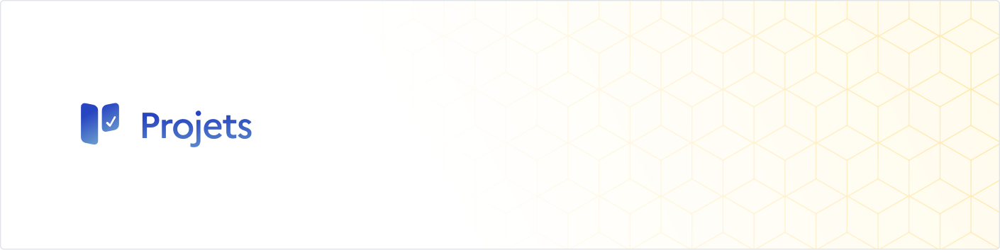
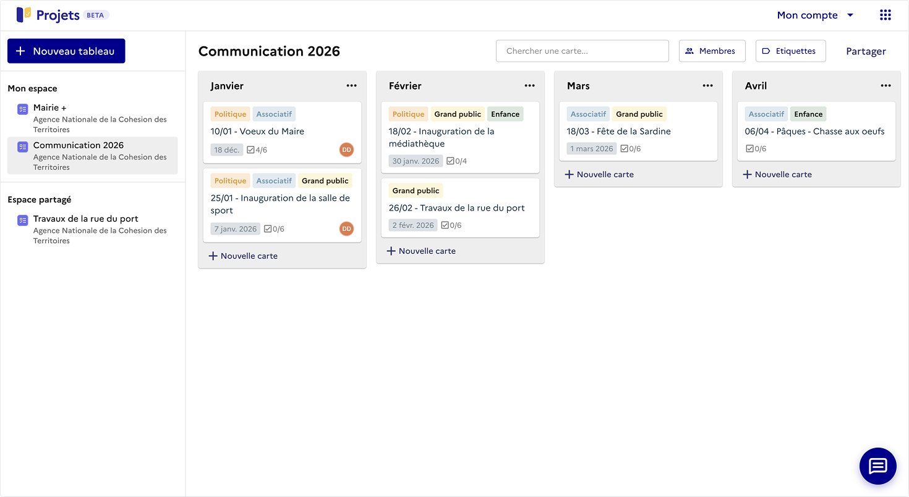

<p align="center">
  <a href="https://github.com/suitenumerique/st-projects">
    
  </a>
</p>
<p align="center">
  <a href="https://github.com/suitenumerique/projects/stargazers/">
    
  </a>
  <a href='https://github.com/suitenumerique/projects/blob/main/CONTRIBUTING.md'></a>
  
  
  <a href="https://github.com/suitenumerique/projects/blob/main/LICENSE">
    
  </a>
</p>
<p align="center">
  <a href="https://matrix.to/#/#projects-official:matrix.org">
    Chat on Matrix
  </a> - <a href="#getting-started-to-develop-">
    Getting started
  </a> - <a href="mailto:contact@suite.anct.gouv.fr">
    Reach out
  </a>
</p>

# La Suite Projects: Collaborative Project Management

Projects, where your plans become progress through live collaboration.

<p align="center">
  
</p>

## Why use Projects❓

- 📊 **Project Management**: Create projects, boards, lists, cards, labels, and tasks
- 🤝 **Collaboration**: Add card members, track time, set due dates, add attachments, write comments
- ✍️ **Rich Content**: Markdown support in card descriptions and comments
- 🔍 **Filtering**: Filter by members and labels
- ⚡ **Real-time Updates**: Live synchronization across all clients
- 🔔 **Notifications**: Internal notification system
- 🌍 **Internationalization**: Multiple interface languages (French, English...)
- 🔐 **Single Sign-On**: OpenID Connect (OIDC) authentication via Keycloak
- 🎨 **Modern UI**: Built with React and modern design components

## Deploy on your provider 🚀

### Requirements

Projects requires some tools to run:

- A PostgreSQL database
- An OpenID Connect provider to authenticate users (it can be any "Single Sign-On" existing service, if none you may have a look at [Keycloak](https://www.keycloak.org/) or [Ory Hydra](https://github.com/ory/hydra) to self-host one)

Optionnally you could set up:

- An object storage bucket to save attachments elsewhere than your local storage (any solution would work if compatible with the S3 standard)

### Use a Docker environment

We provide the Docker image [`lasuite/projects:latest`](https://hub.docker.com/r/lasuite/projects) to deploy Projects. Please refer to the [`docker-compose.yml`](./docker-compose.yml) to see what are the main expected settings to run it properly.

### Use a Node.js environment

If your provider has its own pipeline for building and running Node.js applications, here the main steps you could use to configure in it:

```sh
# Make sure to use Node.js v22
# Install dependencies
npm install

# Build
npm run build

# Move the built frontend to the public server folder
rm -rf server/public/
mv client/build server/public

# Pick up the index.html to be used as templating
cp server/public/index.html server/views/index.ejs

# Clean up what's no longer needed
rm -rf client config docker-* Docker* package* *.md

# Bring everything to the root
mv server/* ./
```

Once it's built, the running commands would be:

```sh
# Process the database migrations
node db/init.js

# Run the server
node app.js --prod
```

## Getting started to develop 🔧

### Local setup required

Before you begin, ensure you have the following installed:

- **Docker** (version 20.10 or later)
- **Docker Compose** (version 2.0 or later)
- **Node.js** 22 (for local development without Docker)
- **npm** (for local development)

Also, to have the OpenID Connect flow working you need to set an alias on the host so the login works. Modify `/etc/hosts` by running `sudo nano /etc/hosts` and append the following content:

```ini
# OpenID Connect requires the issuer hostname to always be the same, so no Docker alias usage is possible, it needs something common with the host
127.0.0.1 auth.local
::1 auth.local
```

Then check it's the alias works by running `ping auth.local`. If it fails you may need to flush your DNS cache.

### Quick Start

#### Using Docker (Recommended)

The easiest way to get started is using:

```bash
docker-compose -f docker-compose-dev.yml up
```

This will:

1. Start all Docker services (PostgreSQL, Keycloak, Server, Client, Nginx)
2. Wait for services to be ready
3. Initialize the database with migrations and seeds
4. Create a default admin user

After setup completes, you can access:

- **Application**: http://localhost:3000 _(credentials: `user.test@suite.anct.gouv.fr` / `password`)_
- **Keycloak admin console for adding new users**: http://localhost:8080 _(credentials: `admin` / `admin`)_

#### Without Docker

For local development without Docker:

```bash
# Install dependencies
npm install

# Set up environment variables (then edit server/.env as needed)
cp server/.env.sample server/.env

# Initialize database
npm run server:db:init

# Start development servers
npm start
```

This will start both the server (port 3000) and client (port 3001) concurrently.

### Tips

#### Using the right theme

The underlying UI framework provides multiple themes like `light`, `dark`, `dsfr-light`, `dsfr-dark`... (the list [is available here](https://github.com/suitenumerique/ui-kit/blob/main/README.md#themes)). By default Projects will use `light` or `dark` depending on the user settings.

In case you want to specify another theme base:

- For development: create the file `client/.env.local` and append inside for example `THEME_PREFIX=dsfr`
- For deployment: provide `THEME_PREFIX=dsfr` as an environment variable

#### Additional stack resources

- [Sails.js Documentation](https://sailsjs.com/documentation)
- [React Documentation](https://react.dev/)
- [Keycloak Documentation](https://www.keycloak.org/documentation)

## Feedback 🙋‍♂️🙋‍♀️

We'd love to hear your thoughts, and hear about your experiments, so come and say hi on [Matrix](https://matrix.to/#/#projects-official:matrix.org).

## Contributing 🤝

Please refer to the [CONTRIBUTING.md](./CONTRIBUTING.md) document. And for major changes, please open an issue first to discuss what you'd like to change.

## License 📝

This work is released under the AGPL-3.0 license.

## Contact 📧

For questions or issues:

- **GitHub Issues**: Use the repository's issue tracker
- **Security Issues**: Please report security vulnerabilities privately

## Credits ❤️

### Origins

Projects is built on top of the first version of [Planka](https://github.com/plankanban/planka). We are deeply grateful for their initial work!

### Gov ❤️ open source

Projects is the result of a joint effort led by the [ANCT](https://anct.gouv.fr/) and the [DINUM](https://www.numerique.gouv.fr/dinum/) from the French government 🇫🇷🥖.

We are always looking for new public partners, feel free to [reach out](mailto:contact@suite.anct.gouv.fr) if you are interested in using or contributing to Projects.

<p align="center">
  
</p>
